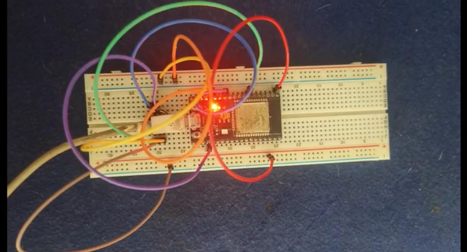
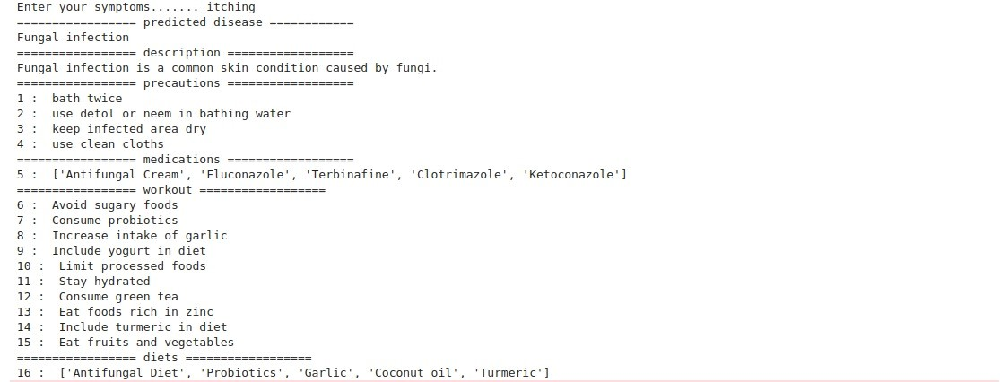

# Healthcare Chatbot with IoT & Cloud Integration
This Project, that is, “AI-Powered Healthcare Chatbot with Cloud Integration & Voice Input” focuses on developing an AI-powered healthcare chatbot that assists users in identifying potential diseases based on symptoms and provides recommendations on medications, diet, precautions, and workouts. The chatbot is built using machine learning models, which analyze user symptoms and predict diseases with high accuracy.

To enhance accessibility, the chatbot features voice input functionality using an INMP441 microphone connected to an ESP32-S microcontroller, allowing users to interact with the system hands-free. The ESP32 captures voice data and transmits it for processing, enabling real-time health consultations.

Additionally, the system integrates with cloud services for secure data storage, model updates, and remote access, ensuring scalability and reliability. This integration enables users to access health insights from multiple devices while maintaining data privacy and security.

By combining AI-driven disease prediction, IoT-based voice input, and cloud integration, this project aims to provide a smart, accessible, and efficient healthcare assistant for users seeking quick and reliable medical guidance.

## Results
### Here is the IoT setup:

### Here is the output:

